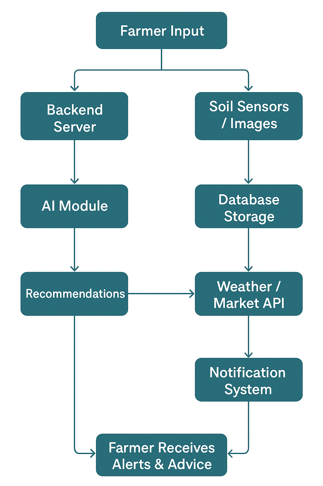

# Smart India Hackathon Workshop
# Date:27-09-2025
## Register Number:25012434
## Name:SAIRAM .V
## Problem Title
SIH 25010: Smart Crop Advisory System for Small and Marginal Farmers
## Problem Description
A majority of small and marginal farmers in India rely on traditional knowledge, local shopkeepers, or guesswork for crop selection, pest control, and fertilizer use. They lack access to personalized, real-time advisory services that account for soil type, weather conditions, and crop history. This often leads to poor yield, excessive input costs, and environmental degradation due to overuse of chemicals. Language barriers, low digital literacy, and absence of localized tools further limit their access to modern agri-tech resources.

Impact / Why this problem needs to be solved

Helping small farmers make informed decisions can significantly increase productivity, reduce costs, and improve livelihoods. It also contributes to sustainable farming practices, food security, and environmental conservation. A smart advisory solution can empower farmers with scientific insights in their native language and reduce dependency on unreliable third-party advice.

Expected Outcomes

• A multilingual, AI-based mobile app or chatbot that provides real-time, location-specific crop advisory.
• Soil health recommendations and fertilizer guidance.
• Weather-based alerts and predictive insights.
• Pest/disease detection via image uploads.
• Market price tracking.
• Voice support for low-literate users.
• Feedback and usage data collection for continuous improvement.

Relevant Stakeholders / Beneficiaries

• Small and marginal farmers
• Agricultural extension officers
• Government agriculture departments
• NGOs and cooperatives
• Agri-tech startups

Supporting Data

• 86% of Indian farmers are small or marginal (NABARD Report, 2022).
• Studies show ICT-based advisories can increase crop yield by 20–30%.

## Problem Creater's Organization
Government of Punjab

## Theme
Agriculture, FoodTech & Rural Development

## Proposed Solution

## Technical Approach
Technology that i use to develop this  web application are,JavaScript for structure,React for framework,php and django for database.
Features:
1.Offline + SMS Support: For regions with poor internet connectivity
2.Cloud & Databases: To store farmer data, soil info, and weather records
3.AI & Data Science (AI&DS): To analyze past weather data, crop patterns, and soil reports for predicting future conditions and giving personalized advice.

## Feasibility and Viability
The project is realistic because AI&DS models can be trained using already available datasets like Soil Health Cards, IMD (Indian Meteorological Department) weather data, and government crop reports.
1.Challenges: 
Farmers may hesitate to trust an app, and internet is weak in many rural areas.
2.Solutions
Build awareness programs through NGOs and agri-officers to create trust.
## Impact and Benefits
1.Farmers earn more profit by reducing unnecessary costs.
2.Balanced fertilizer/pesticide use protects soil and water.
3.Helps achieve Digital India and smart agriculture goals.
4farmers can sell at the right place and time.

## Research and References
https://www.oecd.org/en/topics/sub-issues/innovation-and-digital-in-agriculture.html
